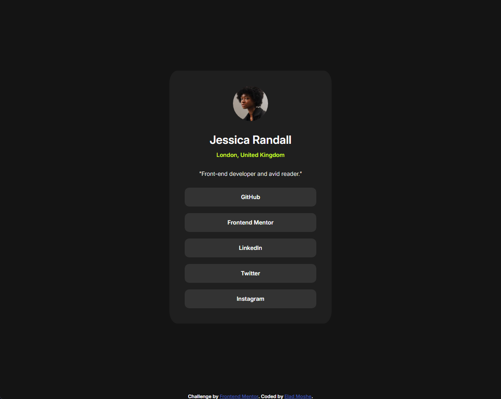

# Frontend Mentor - Social links profile solution

This is a solution to the [Social links profile challenge on Frontend Mentor](https://www.frontendmentor.io/challenges/social-links-profile-UG32l9m6dQ). Frontend Mentor challenges help you improve your coding skills by building realistic projects. 

## Table of contents

- [Overview](#overview)
  - [The challenge](#the-challenge)
  - [Screenshot](#screenshot)
  - [Links](#links)
- [My process](#my-process)
  - [Built with](#built-with)
  - [What I learned](#what-i-learned)
  - [Continued development](#continued-development)
  - [Useful resources](#useful-resources)
- [Author](#author)
- [Acknowledgments](#acknowledgments)

## Overview

### The challenge

Users should be able to:

- See hover and focus states for all interactive elements on the page

### Screenshot



### Links

- [Solution](https://www.frontendmentor.io/solutions/responsive-social-links-profile-with-css-flexbox-yN9fgWP9Cn)
- [Live Site](https://pherom.github.io/social-links-profile/)

## My process

### Built with

- Semantic HTML5 markup
- CSS custom properties
- Flexbox
- Mobile-first workflow

### What I learned

Working on this challenge allowed me to practice and solidify my understanding of Flexbox for layout management. I also gained experience using CSS custom properties (variables) to manage colors and other design elements consistently throughout the project.

Here are some code snippets I'm proud of:

```css
#links a {
    text-decoration: none;
    color: var(--white);
    display: block;
    background-color: var(--light-grey);
    width: 100%;
    padding: 15px 0;
    border-radius: 10px;
    transition: background-color, 200ms;
}

#links a:hover,
#links a:focus {
    background-color: var(--green);
    color: var(--dark-grey);
}
```

This CSS snippet handles the hover and focus states for the social links, ensuring a smooth user experience and visual feedback for interactivity.

### Continued development

In future projects, I want to focus more on:

- Improving accessibility by adding ARIA labels and better keyboard navigation support.
- Exploring CSS Grid for more complex layouts.
- Delving deeper into responsive design practices.

### Useful resources

- [MDN Web Docs - Flexbox](https://developer.mozilla.org/en-US/docs/Learn/CSS/CSS_layout/Flexbox) - This article helped me understand the basics of Flexbox and how to apply it in my project.
- [Colt Steele's Web Developer Bootcamp on Udemy](https://www.udemy.com/course/the-web-developer-bootcamp/?couponCode=OF83024B) - This course taught me the fundamentals of web development and beyond.

## Author

- LinkedIn - [Pherom](https://www.frontendmentor.io/profile/Pherom)
- Frontend Mentor - [@pherom](https://github.com/Pherom)

## Acknowledgments

Thanks to the Frontend Mentor community for providing such a great platform to learn and improve coding skills through real-world projects. Special thanks to those who provided feedback on my solution.

And also, I'd like to thank Colt Steele for teaching me web development.
Check out his course on Udemy in the Useful resources section of this README.
